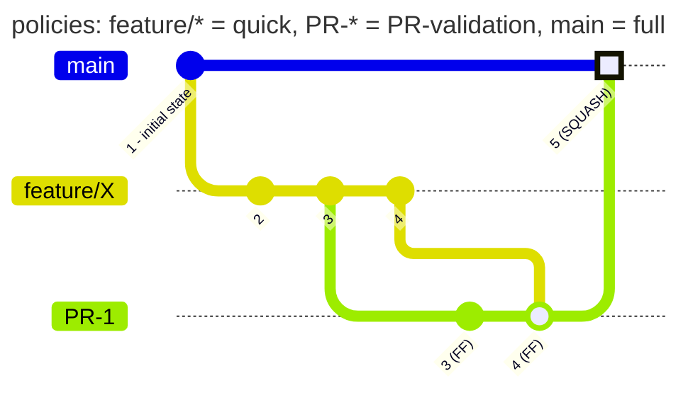
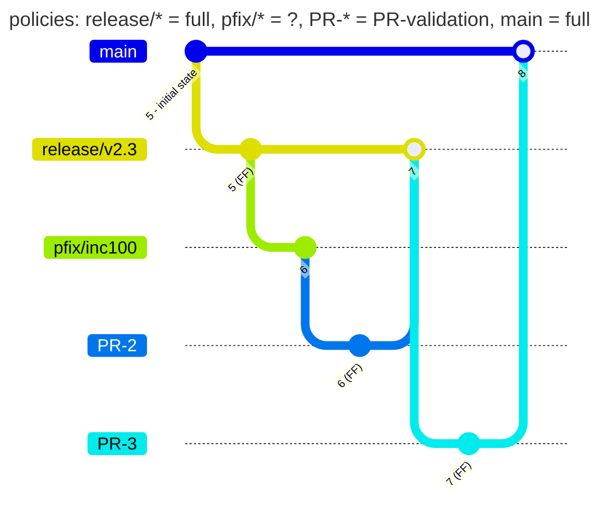

# Scenario 4 - feature

# Scenario 5 - Production Fix

# Scenario 1 - release branch as production snapshot

Promoting build b101 to UAT automatically creates the Release and related Change ticket;
promoting build b105 into production creates the release branch automatically;
promoting b105 does not because we have not production deploy yet,
while b109 happens after a production release so it creates a new Release.

| commit                  | branch                     | build          | dev deploy  | release | change | uat deploy | prod deploy | incident |
|-------------------------|----------------------------|----------------|-------------|---------|--------|------------|-------------|----------|
| c1000                   | main                       |                |             |         |        |            |             |          |
| c1000                   | feature/A (from main)      |                |             |         |        |            |             |          |
| c1001                   | feature/A                  | b100           | v1.0.0-b100 |         |        |            |             |          |
| c1002 (merge feature/A) | main                       | b101           | v1.0.0-rc   |         |        |            |             |          |
|                         |                            | _promote b101_ |             | RLS100  | CHG100 | v1.0.0-rc  |             |          |
| c1002                   | feature/B (from main)      |                |             |         |        |            |             |          |
| c1003                   | feature/B                  | b102           | v1.1.0-b102 |         |        |            |             |          |
| c1002                   | bug/C (from main)          |                |             |         |        |            |             |          |
| c1004                   | bug/C                      | b103           | v1.0.1-b103 |         |        |            |             |          |
| c1005                   | feature/B                  | b104           | v1.1.0-b104 |         |        |            |             |          |
| c1006 (merge bug/C)     | main                       | b105           | v1.0.1-rc   |         |        |            |             |          |
|                         |                            | _promote b105_ |             |         | CHG101 | v1.0.1-rc  |             |          |
|                         |                            | _promote b105_ |             |         | CHG102 |            | v1.0.1      |          |
| c1006                   | release/rls100 (from main) |                |             |         |        |            |             |          |
| c1007                   | feature/B                  | b107           | v1.1.0-b107 |         |        |            |             |          |
| c1008 (merge main)      | feature/B                  | b108           | v1.1.0-b108 |         |        |            |             |          |
| c1009 (merge feature/B) | main                       | b109           | v1.1.0-rc   |         |        |            |             |          |
|                         |                            | _promote b109_ |             | RLS101  | CHG103 | v1.1.0-rc  |             |          |
| c1009                   | release/rls101 (from main) |                |             |         |        |            |             |          |

# Scenario 2 - production incident requiring a P-Fix

b106 is from hotfix branch (created from the current release branch) so it creates an Emergency Change automatically.

| commit                           | branch                              | build          | dev deploy  | release | change   | uat deploy | prod deploy | incident   |
|----------------------------------|-------------------------------------|----------------|-------------|---------|----------|------------|-------------|------------|
| c1000                            | main                                |                |             |         |          |            |             |            |
| c1000                            | feature/A (from main)               |                |             |         |          |            |             |            |
| c1001                            | feature/A                           | b100           | v1.0.0-b100 |         |          |            |             |            |
| c1002 (merge feature/A)          | main                                | b101           | v1.0.0-rc   |         |          |            |             |            |
|                                  |                                     | _promote b101_ |             | RLS100  | CHG100   | v1.0.0-rc  |             |            |
| c1002                            | feature/B (from main)               |                |             |         |          |            |             |            |
| c1003                            | feature/B                           | b102           | v1.1.0-b102 |         |          |            |             |            |
| c1002                            | bug/C (from main)                   |                |             |         |          |            |             |            |
| c1004                            | bug/C                               | b103           | v1.0.1-b103 |         |          |            |             |            |
| c1005                            | feature/B                           | b104           | v1.1.0-b104 |         |          |            |             |            |
| c1006 (merge from bug/C)         | main                                | b105           | v1.0.1-rc   |         | CHG101   | v1.0.1-rc  |             |            |
|                                  |                                     | _promote b105_ |             |         | CHG102   |            | v1.0.1      |            |
| c1006                            | release/rls100 (from main)          |                |             |         |          |            |             |            |
|                                  |                                     |                |             |         |          |            |             | **INC100** |
| c1006                            | hotfix/inc100 (from release/rls100) |                |             |         |          |            |             |            |
| c1007                            | hotfix/inc100                       | b106           | v1.0.2-pfix |         |          |            |             |            |
|                                  |                                     | _promote b106_ |             |         | E-CHG103 |            | v1.0.2      |            |
| c1008 (merge from hotfix/inc100) | main                                | b107           |             |         |          |            |             |            |
| c1009                            | feature/B                           | b108           | v1.1.0-b108 |         |          |            |             |            |
| c1010 (merge main)               | feature/B                           | b109           | v1.1.0-b109 |         |          |            |             |            |
| c1011 (merge feature/B)          | main                                | b110           | v1.1.0-rc   |         |          |            |             |            |
|                                  |                                     | _promote b110_ |             | RLS101  | CHG104   | v1.1.0-rc  |             |            |

# Scenario 3 - release branch as release candidate

The release branch is created when promoting to UAT.

| commit                            | branch                              | build          | dev deploy  | release | change   | uat deploy | prod deploy | incident   |
|-----------------------------------|-------------------------------------|----------------|-------------|---------|----------|------------|-------------|------------|
| c1000                             | main                                |                |             |         |          |            |             |            |
| c1000                             | feature/A (from main)               |                |             |         |          |            |             |            |
| c1001                             | feature/A                           | b100           | v1.0.0-b100 |         |          |            |             |            |
| c1002 (merge feature/A)           | main                                | b101           | v1.0.0-rc   |         |          |            |             |            |
| c1002                             | release/rls100 (from main)          | _promote b101_ |             | RLS100  | CHG100   | v1.0.0-rc  |             |            |
| c1002                             | feature/B (from main)               |                |             |         |          |            |             |            |
| c1003                             | feature/B                           | b102           | v1.1.0-b102 |         |          |            |             |            |
| c1002                             | bug/C (from release/rls100)         |                |             |         |          |            |             |            |
| c1004                             | bug/C                               | b103           | v1.0.1-b103 |         |          |            |             |            |
| c1005                             | feature/B                           | b104           | v1.1.0-b104 |         |          |            |             |            |
| c1006 (merge from bug/C)          | release/rls100                      | b105           | v1.0.1-rc   |         |          |            |             |            |
|                                   |                                     | _promote b105_ |             |         | CHG101   | v1.0.1-rc  |             |            |
| c1007 (merge from release/rls100) | main                                | b106           |             |         |          |            |             |            |
|                                   |                                     | _promote b105_ |             |         | CHG102   |            | v1.0.1      |            |
|                                   |                                     |                |             |         |          |            |             | **INC100** |
| c1008                             | hotfix/inc100 (from release/rls100) |                |             |         |          |            |             |            |
| c1009                             | hotfix/inc100                       | b107           | v1.0.2-pfix |         |          |            |             |            |
|                                   |                                     | _promote b107_ |             |         | E-CHG103 |            | v1.0.2      |            |
| c1010 (merge from hotfix/inc100)  | release/rls100                      |                |             |         |          |            |             |            |
| c1011 (merge from release/rls100) | main                                | b108           |             |         |          |            |             |            |
| c1012                             | feature/B                           | b109           | v1.1.0-b108 |         |          |            |             |            |
| c1013 (merge main)                | feature/B                           | b110           | v1.1.0-b109 |         |          |            |             |            |
| c1014 (merge feature/B)           | main                                | b111           | v1.1.0-rc   |         |          |            |             |            |
|                                   |                                     | _promote b110_ |             | RLS101  | CHG104   | v1.1.0-rc  |             |            |
